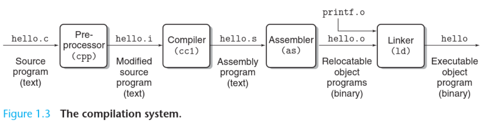

_______
Consider this source code of a `hello` C program which prints Hello world on the screen:
```c
#include <stdio.h>
int main(){
	printf("Hello world\n");
	return 0;
}
```
- This program begins life as a high-level C program that can be read and understood by humans as discussed earlier.
- These individual C statements must be translated by other programs (compilers) into a sequence of low-level **machine-language** instructions.
- These instructions are then packaged in a form called an **executable object program** (object programs are also referred to as **executable object files**)
- On a Unix system, the translation from source files to object files is performed by a **compiler driver**.

The following command invokes the gcc compiler which is the native compiler for C programs in Unix systems
```
gcc -o hello hello.c
```

_______
#### The Stages of Compilation


1. **The Pre-Processor** handles certain directive and instructions before the code is compiled. For example, whenever an `#include` statement is encountered, the pre-processor replaces it with the content of the file included.
2. **The Compiler** checks for errors and translates the high level code into assembly instructions. Note that this step is the most significant as the high level statements get "translated" into assembly instructions, and depending on the *optimization level*, the assembly produced might not correspond to the high level code as expected (but still carry out the same task of course). At this stage, the resulting file is still a *text file* which contains assembly instructions. 
The command `gcc -S hello.c` will output a `hello.s` file which contains the assembly instructions without proceeding to invoke the assembler.
3. **The Assembler** turns assembly instructions into machine code. This is *mostly* a one-to-one mapping between assembly instructions understood by humans (like `mov eax ebx`) to binary instructions understood by the CPU (like `0x89 0xD8` which is `10001001 11011000`).
4. **The Linker** combines functions and libraries, for example it resolves functions called in one file but defined in another
_____

> Takeaway Concept

Note that before assembly code is turned into an object file, it is still a text file. For example, if you open `hello.s` with a text editor, you’d see assembly instructions. But once the assembler takes this `hello.s` file and turns it into a `hello.o` file, it is no longer a text file and its bytes do not represent ASCII characters anymore. Now it’s an object executable file containing binary instructions the CPU can understand.

_______
