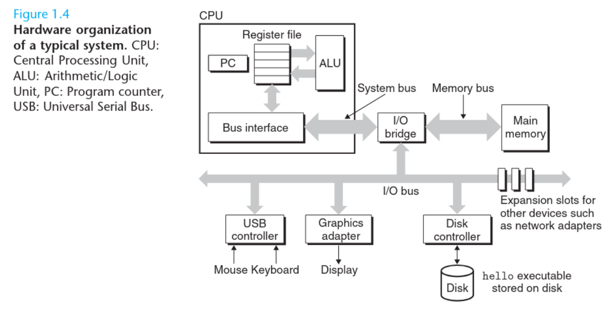

_________

________
#### Buses
Buses are electrical circuits that carry bytes of information back and forth between components. Buses are typically designed to transfer fixed-sized chucks of bytes known as **words**. 
The number of bytes in a word (the **word size**) is a fundamental system parameter that varies across systems: most machines today have word sizes of either **4 bytes** (32 bits) or **8 bytes** (64 bits).
______
#### I/O Devices 
Input/Output devices are the system’s connection to the external world.
Each I/O device is connected to the I/O bus by either a **controller** or an **adapter**.
**Controllers** are chip sets in the device itself (on the computer’s motherboard) while **Adapters** are cards that plug into a slot on the motherboard. The purpose of each is to carry info back and forth between I/O buses and I/O devices.
______
#### Main Memory
The main memory consists of a collection of **Dynamic Random Access Memory** (DRAM) chips. Logically, memory is organized as a linear array of bytes, each with it’s own unique address (array index) starting at zero.
_____
#### Processor 
The Central Processing Unit (CPU) is the engine that executes instructions stored in the main memory.
At its core is a **word-sized** storage device or **register** called the **Program Counter** (PC). At any point in time, the PC points at (contains the address of) the next machine-language instruction stored in the main memory.
_________
### The Instruction Set Architecture 
The Instruction Set Architecture of a processor is a set of *simple* operations (like add, move, load) that the processor can execute.
There are only a few of these simple operations, and they revolve around the **main memory**, **register file** and the **Arithmetic/Logic Unit** (ALU). 

The ALU computes new data and address values stored in registers.

____
>Examples of ISAs are:
>- x86
>- ARM
_______
### Register Files
A Register File is a small storage device found in the CPU that consists of a collection of word-sized registers, each with its own unique name. Note that the CPU can only operate on data stored in registers, meaning, if a CPU wants to add two numbers, it must first fetch them from the memory and into two registers, and then add them before returning the result and storing it in memory.
____________
>DRAM vs SRAM
>Dynamic RAM (DRAM) stores data using tiny capacitors that need constant refreshing because they naturally lose charge over time, which makes DRAM slower but cheaper and denser, and this is why it’s used for a computer’s main memory. **Static RAM** (SRAM) on the other hand uses flip-flop circuits to store data, so it doesn't need refreshing and is much faster but also more expensive and takes up more space. SRAM is used in CPU caches.

_________
