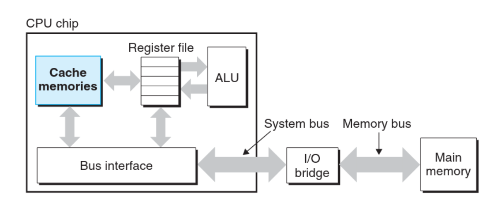

_________
The system spends a lot of time moving information from one place to another (fetching data from disk, to main memory, to register file, to CPU and repeat). Because of this, a major goal for system designers should be to make these operations as fast as possible.

______
> Takeaway Concept
> 
Because of *physical laws*, larger storage devices are slower than smaller ones. Reading from a register is much faster than reading from the main memory, but the register file is much smaller in size compared to the main memory.
__________
### Solution?
The CPU operates at a much higher speed than the main memory, and because of that, system designers include much faster but smaller storage devices called **Cache Memories** that serve as temporary staging areas for information that the processor is likely to need in the near future.

Cache memory exists in different layers: an L1 cache is the smallest but fastest, larger L2 cache is slower and so on. 
Cache is implemented with a hardware technology known as **==Static Random Access Memory==** (SRAM) discussed earlier.
________
