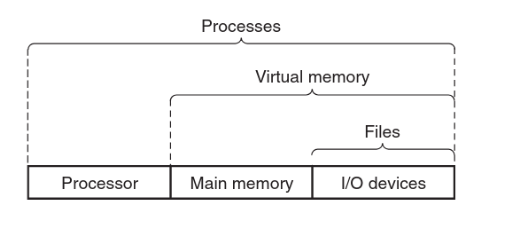

________
Let’s examine the simple `hello` C program (which outputs “Hello World” to the screen (or more percisely, onto the *output stream* `stdout`)). 

When this program is run on a **terminal** (a shell), the shell first loads it and then runs it. The `hello` program then prints its output.  
During that process, **neither program accessed the keyboard, display, disk, or main memory directly.** Rather, they relied on the services provided by the Operating System.
____
> Takeaway Concept
> 
We can think of the OS as a layer of software between the application programs and the hardware. All attempts by an application program to manipulate the hardware *must* first go through the OS.

__________
#### The OS has two primary purposes:
1. To protect the hardware of misuse by runaway applications.
2. To provide applications with simple and uniform mechanisms for manipulating complicated low-level hardware devices.

______

#### The OS achieves both goals via three fundamental abstractions:
- Processes
- Virtual memory
- Files  

- Processes are abstractions for the processor, main memory and I/O devices.
- Virtual memory is an abstraction for main memory and I/O devices.
- Files are abstractions for I/O devices.
_______
