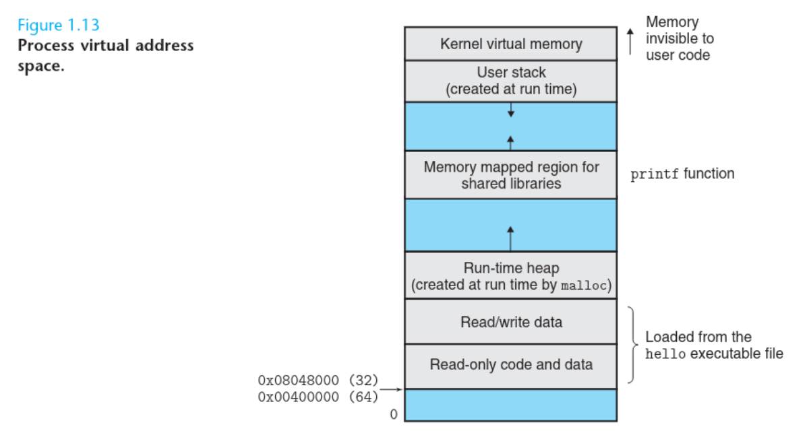

______
**Virtual Memory** is an abstraction that provides each process with the illusion that it has exclusive use of the main memory.  
Each process has the same uniform view of memory, which is known as its **Virtual Address Space** — a kind of a *private view* of memory. This is **not the actual physical memory**, but a **mapped layout** that the process thinks is its memory.

_______

### How does Virtual Memory work?

- Each process gets its own **virtual address space** that is **independent** of the actual physical memory.
- The operating system (with help from the CPU's Memory Management Unit, or **MMU**) **maps** virtual addresses to physical addresses.
- So when Process A thinks it's reading from `0x00400000`, and Process B also thinks it's reading from `0x00400000`, **they are actually reading from different places in the physical RAM**.
The OS sets up **page tables** that say:
- "When Process A accesses virtual address `0x00400000`, **translate** it to physical address `0x12345000`."
- "When Process B accesses virtual address `0x00400000`, **translate** it to physical address `0xABCDF000`."
_________
### Looking briefly at each memory space:
1. **Read-only code and data**: executable machine code and read-only constants. This part contains the compiled program instructions and the constants initialized inside of it.
2. **Read/Write Data**: contains global static variables with initial values, and it’s both readable and writable. 
3. **Run-time Heap**: created by functions like `malloc()` and it grows **upwards** (towards the higher addresses). It exists as long as the program runs or until manually freed.
4. **Memory Mapped Region for Shared Libraries**: contains shared libraries (like `libc.so` which contains functions like `printf`), and it’s shared between processes. 
5. **Stack**: at the top of the user’s virtual address space is the user stack that the compiler uses to implement function calls. Like the heap, the user stack expands and contracts dynamically during the execution of the program. In particular, each time we call a function, the stack grows. Each time we return from a function, it contracts. Note that the stack grows **downwards**.
6. **Kernel virtual memory**: the kernel is the part of the operating system that is always resident in memory. The top region of the address space is reserved for the kernel. Application programs are not allowed to read or write the contents of this area or to directly call functions defined in the kernel code.
__________

