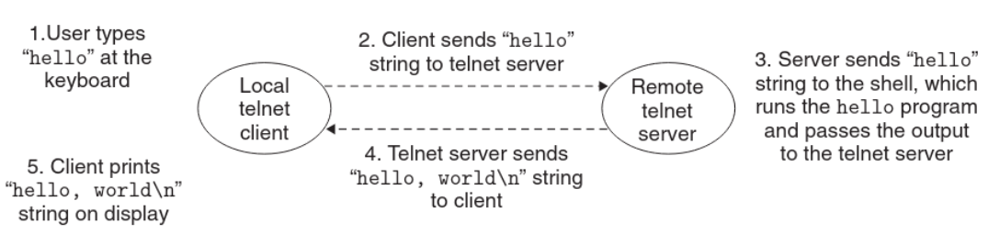

_________
Suggest we have a simple `hello` program which outputs `Hello world` to the screen.
If we’re trying to run it remotely via telnet, the process would go as follows:  

_______
> Takeaway Concept  

A network is simply another I/O device.
_________

_________

