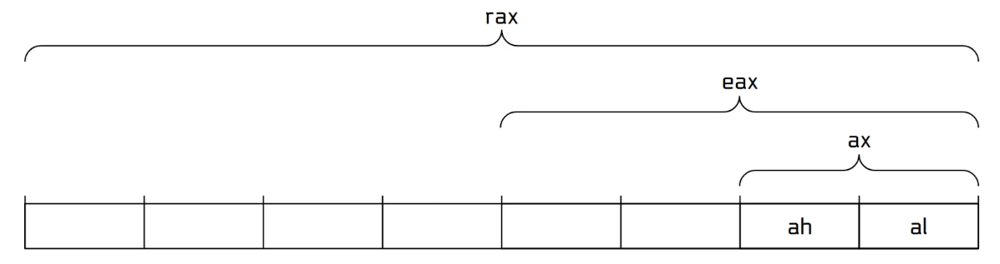

Modern computing systems are typically classified as either `32-bit` or `64-bit`. This concept is fundamental in describing the capabilities of the processor, software compatibility and memory usage, among other things.  
32-bit systems commonly operate with the `x86` (IA32)instruction set architecture, while 64-bit systems operate with the extension of `x86` called `x86_64` (originally desinged by AMD) or Intel's compatible version known as Intel 64.    

> Note that the idea of 32/64 bit architecture encompasses both hardware and software aspects. The hardware aspect of it is the actual design of the processor and data buses, while the software aspect involves the Instruction Set Architecture which describes the low level operations the processor executes. 

____________

### The Word Size
A **Word** is the standard unit of data the CPU processes at once. 
- 32-bit systems have a word size of `32` bits (4 bytes)
- 65-bit systems have a word size of `64` bits (8 bytes)

The word size determines:
- The size of general-purpose registers
- The width of CPU data buses
- The maximum addressable memory space
- The default size of pointers in machine code

________

### Registers
- There are 8 general registers in 32 bit systems, each is 32 bits in size.
- There are 16 general registers in 64 bit systems, each is 64 bits in size. 

| Purpose           | 32-bit (x86) | 64-bit (x86-64) | Description                               |
| ----------------- | ------------ | --------------- | ----------------------------------------- |
| Accumulator       | `EAX`        | `RAX`           | Used for arithmetic operations            |
| Base              | `EBX`        | `RBX`           | General data storage                      |
| Counter           | `ECX`        | `RCX`           | Used in loops and shifts                  |
| Data              | `EDX`        | `RDX`           | Also used in division/multiplication      |
| Source Index      | `ESI`        | `RSI`           | Used for string operations (source)       |
| Destination Index | `EDI`        | `RDI`           | Used for string operations (destination)  |
| Stack Pointer     | `ESP`        | `RSP`           | Points to the top of the stack            |
| Base Pointer      | `EBP`        | `RBP`           | Used for stack frame reference            |
| —                 | —            | `R8` to `R15`   | Extra general-purpose registers in 64-bit |

Note that because 64-bit systems are backward compatible, the 32 bit registers (like `eax` instead of `rax`) could still be accessed in 64 bit systems.

   

> `ax` (along with `bx`, `cx` and so on) are legacy 16-bit registers, which still could be accessed in 32-bit and 64-bit systems.

______

### Address Space

Because registers in 32-bit systems are 32 bits in size, the maximum size of a pointer (which is a memory address) is also 32 bits. Thus, a 32-bit system can reference up to `2^32` *unique* addresses. (and `2^64` addresses on 64-bit systems).

| System | Address Width | Max Addressable Memory        | Address range                                |
| ------ | ------------- | ----------------------------- | ---------------------------------------------|
| 32-bit | 2³² bits      | \~4 GiB (4,294,967,296 bytes) | `0x00000000` to `0xFFFFFFFF`                 |
| 64-bit | 2⁶⁴ bits      | \~18.4 exabytes (theoretical) | `0x0000000000000000` to `0xFFFFFFFFFFFFFFFF` |

This shows that 32-bit systems cannot allocate more than ~4 GB of RAM to processes, even if the physical RAM was larger than 4 GB. This is simply because there are not enough addresses to reference that space.  

The memory address range of 32-bit systems 

> Remember that each memory address is used to address 1 byte (8 bits).

_________

### Operating System and Application Compatibility
- A 32-bit operating system runs on 32-bit CPUs and can only execute 32-bit applications (that is, programs compiled for the 32-bit instruction set architecture).
- A 64-bit operating system runs on 64-bit CPUs and can typically execute both 64-bit and 32-bit applications via compatibility layers (such as WoW64 on Windows or multilib support on Linux).
- Modern systems are almost universally 64-bit at both the hardware and OS level. However, many applications are still compiled and ran as 32-bit, either for compatibility, size efficiency, or because they don’t require the extended capabilities of 64-bit systems.
________
