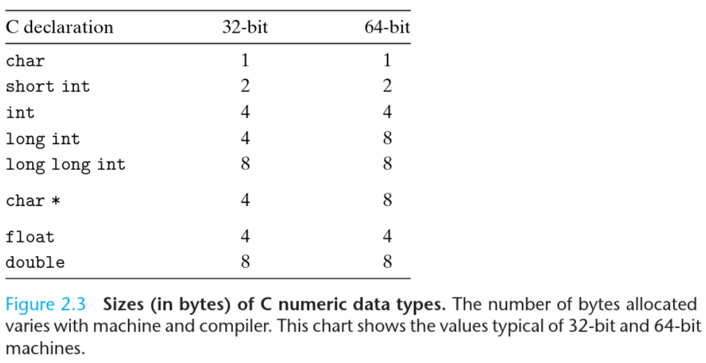

______
Rather than accessing individual bits in memory, most computers use blocks of eight bits (one byte) as the smallest addressable unit  of memory. 

A machine-level program views memory as a very large array of bytes, referred to as **virtual memory**. Each byte of memory is identified by a unique number, known as its **address**, and the set of all possible addresses is known as the **virtual address space**.
______
### Hexadecimal Notation
Hex uses numbers from 0-9 and characters from A-F to represent 16 possible values.
Two digits in hex can represent 255 unique values, the same amount eight digits in binary can represent.  
`0xFF` = `11111111` because `16^2` = `2^8`
___
> Remember:  
> whatever value that starts with `0x` or `0X` is a value represented in hex. Hex is case-insensitive, so `0x49f` = `0x49F`
_____
### Words
Every computer has a **word size**, which indicates its **pointer size** (memory address size). It also refers to the amount of data the CPU stores in one register.  
In 32 bit systems, the word size is 32 bits. This means multiple things:
- There are `2^32` possible memory addresses (around 4 billion).
- The addresses would be represented using 32 bits (duh) and would range from `0x00000000` to `0xFFFFFFFF`.
- Each register would have the size of 32 bits.

______
> **Binary to Hex conversion**
> 
> `8` bits can represent `256` different values (each digit can represent one of two possible values and we have 8 digits, so `2^8`)   
> These `256` unique values can be represented using two hex digits (because each digit can represent one of sixteen possible values and we have two digits, so `16^2` which is `256`.
> Thus, each byte could be represented using two hex digits. The range would be `0-255` in binary, and `0x00-0xFF` in hex.
_____

Since a virtual address is encoded by such a word, the most important system parameter determined by the word size is the **maximum size of the virtual address space**.  
That is, for a machine with a w-bit sized word, the virtual addresses can range from `0` to `(2^w)-1`, giving the programs access to *at most* `2^w` bytes.

_____
### Data Sizes

_________________
