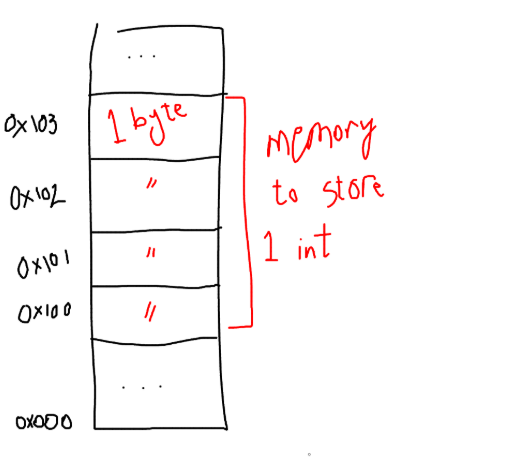
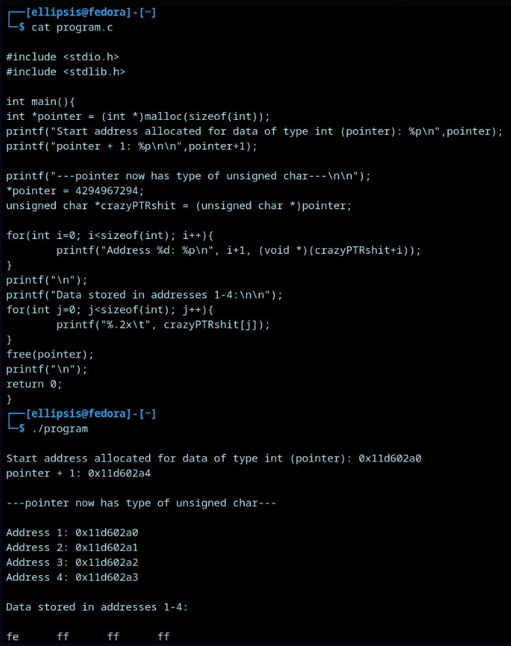

_______ 
For program objects that span multiple bytes, we must establish two conventions:
what the address of the object will be, and how we will order the bytes in memory.

That is, if I have a variable of type `int` has the address `0x100` (meaning, the value of the address expression `&x` is `0x100`), then memory addresses allocated to store that int would be `0x100`, `0x101`, `0x102` and `0x103`.


________

### Demonstration


_____________
### Big Endian VS Little Endian
In a little endian system, the least significant byte is stored first (at the lowest memory address).
For example, in the previous code I stored the value of `4294967294` in 4 bytes. The representation of this number in hex is `fffffffe`, but in memory it was stored as:
```
Address 1: fe
Address 2: ff
Address 3: ff
Address 4: ff
```
(the least significant byte (`fe`) was stored first).

Big endian systems are the opposite. 

__________

There is no technical difference between the two, however there are times where byte ordering becomes an issue, for example:
- When a little endian system sends data to a big endian system over the network.
- When a disassembler displays bytes and writes them in reverse order.
_______
