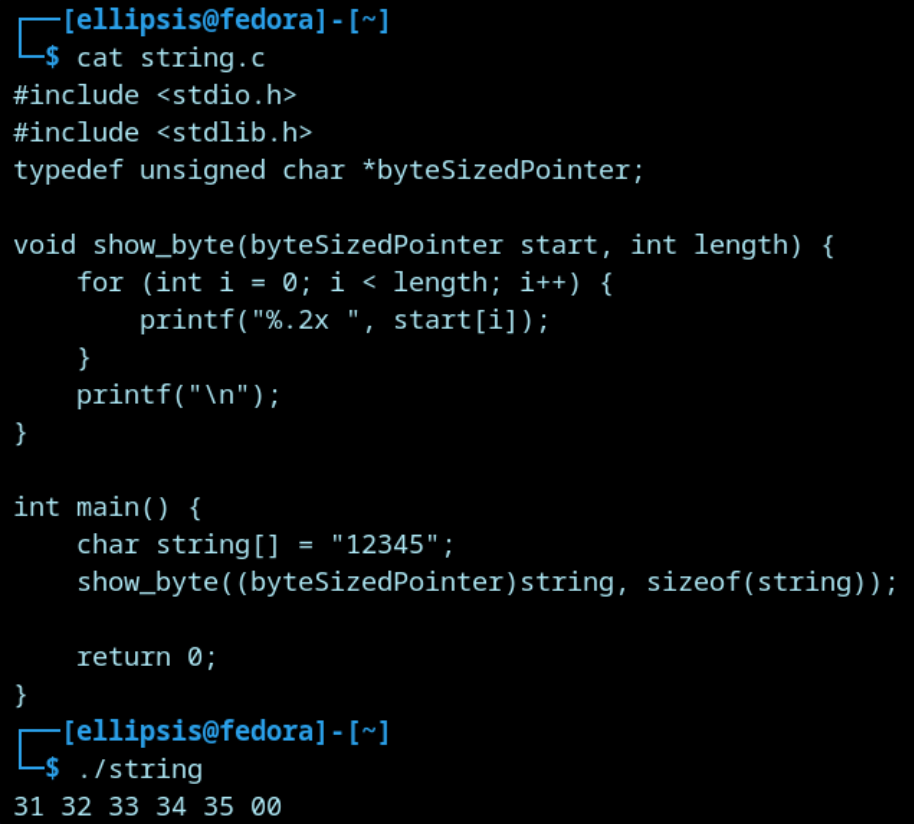
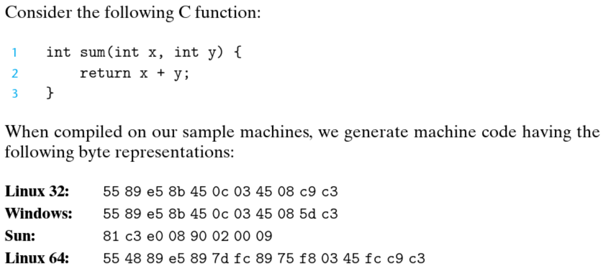

_______
### Representing Strings
Consider the following C code:

This code creates a string with the value `"12345"`, and then prints the bytes stored in the memory address that is storing this string.
Notice how the value of `"12345"` is actually stored in memory as `31 32 33 34 35 00`, that’s because these are the corresponding ASCII encodings for each character (the string `"1"` corresponds to `"31"` in ASCII). Also, notice the `00` in the end, which is the null terminator showing the end of the string.  

This beautifully shows the difference between how strings and integers are handled in memory. If we were to store the integer `1` instead of the *string* `1` (denoted by the quotes), it would be stored in memory as `0x01`, not `0x31`.  

_________
### Representing Code

As we know, programs are compiled to binary code that gets executed by the CPU. Compiler generate this binary code based on different factors such as the CPU architecture and the operating system conventions, that's why it differs across different systems.

________
