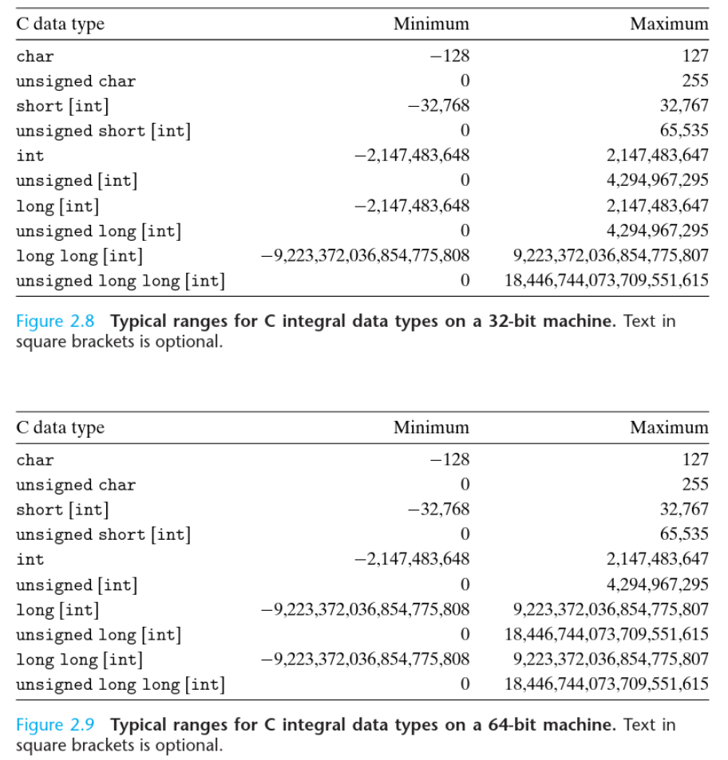
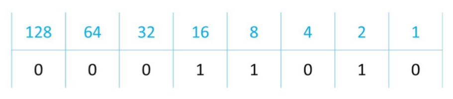

__________


Note that by default, an integral data type will represent signed values (include both negative and positive values in the available range).
______
Integers are typically stored in 4 consequtive bytes after being converted to binary.
```
25 in decimal  = 00000000 00000000 00000000 00011001 in binary
```
_____
### Representing Negative Values
**Two’s Complement** is a way of encoding negative numbers in binary, it works as follows:  
Imagine we’re using 8 bits to store integers. These 8 bits can represent up to `2^8` different values, which is the range from `0` to `255`.
The Two’s Complement encoding scheme will assume that the leftmost bit (the most significat bit) is `-128` instead of `128`.  

Doing this will allow us to represent the range numbers in the range `-128` up to `127`.
```
1000 0000 is -128
1000 0001 is -127 

and so on, all the way up to

1111 1111 which is -1
0000 0000 which is  0
0000 0001 which is  1

and so on, all the way up to

0111 1111 which is 127
```

___________
