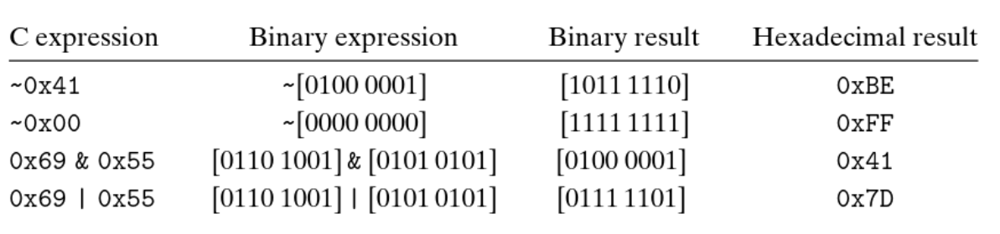
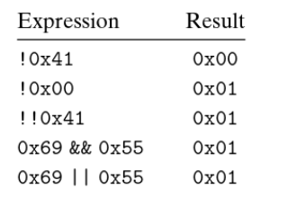

__________
### Bit-wise Operations (bit-level operations)
In C, we can apply the following operations on “integral” data types
- `&` - AND
- `|` – OR (inclusive OR)
- `^` – XOR (exclusive OR)
- `~` – NOT

By “Integral” we mean data of type `int` or `char`, and not `float` or `double` as these are presented differently in memory. 

These operations are performed on the individual bits inside a “bit vector”. (a bit vector being a series of bits)  

_______
#### Masking Operations
One common use of bit-level operations is to implement **masking** operations, where we use a bit pattern as a mask that indicates a selected set of bits within a word.
For example, if i want to extract the least significant bits of an integer `x`, i can implement the mask `x & 0xFF`, which works like this:

```
Suppose x = 0x12345678
So in binary, x = 00010010 00110100 01010110 01111000

mask = 0xFF
So in binary, mask = 00000000 00000000 00000000 11111111

x & mask goes as follows:

00010010 00110100 01010110 01111000  &
00000000 00000000 00000000 11111111   
___________________________________
00000000 00000000 00000000 01111000

thus extracting the least significant byte (01111000) out of x
```
> this works because the operand `&` will always yield to `0` if one of the inputs are `0` (thus eliminating bits that correspond to `0` in the mask), and will always yield to `1` if two inputs are `1` (thus successfully extracting `1`’s from x when they’re present), and will always yield to `0` if `0` was present in `x` (even when `1` is present in the mask).
________
### Logical Operations
We can also apply a set of *logical* operators:
- `&&` – AND
- `||` – OR
- `!` – NOT

Logical operators behave completely differently from bit-level operators: logical operators treat inputs as either `TRUE` (if input isn’t of value `0`) and `FALSE` if input has value `0`.

_______
