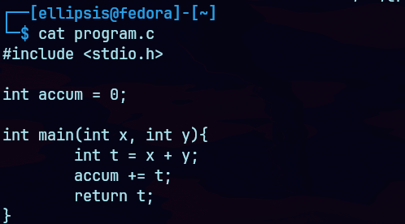
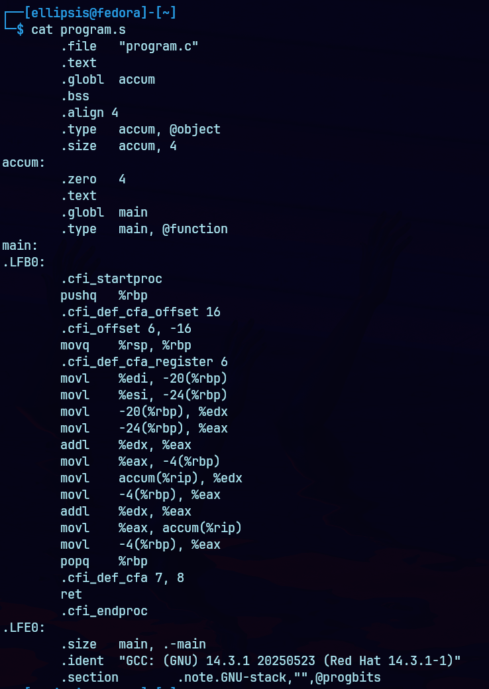
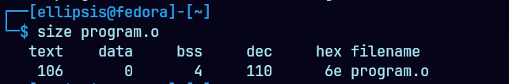

Suppose we write a C program as two files `p1.c` and `p2.c`. We can then compile them into one executable using the following command:
```
gcc -O1 -o p p1.c p2.c
```
- `-O1` specifies the optimization level, in this case it's 1. In general, increasing the level of optimization makes the final program run faster, but at the risk of increased compilation time and difficulties understanding the relation between the original code and the compiled code.
- `-o p` specifies the output file, in this case it's simple `p`.
- `p1.c p2.c` are the files that we want to compile. GCC will compile and link them into one executable program.

______

> Reminder   
The gcc command actually invokes a sequence of programs to turn the source code into executable code. First, the C preprocessor expands the source code to include any files specified with `#include` commands and to expand any macros,specified with `#define` declarations. Second, the compiler generates assembly-code versions of the two source files having names `p1.s` and `p2.s`. Next,the assembler converts the assembly code into binary object-code files `p1.o` and `p2.o`.  
Object code is one form of machine code, it contains binary representations of all of the instructions, but the addresses of global values are not yet filled in. Finally,the linker merges these two object-code files along with code implementing library functions (e.g., `printf`) and generates the final executable code file `p`. 

___________

### Machine Level Code
As discussed earlier, computer systems use **abstraction** to hide implementation details behind simpler models. Two key abstractions important to machine-level programming are:  
1. **The Instruction Set Architecture (ISA)**:  
Defines how machine-level programs look and behave. Different processors use different ISAs (like IA32 and x86_64).
2. **Virtual Memory Addresses**:  
Programs use virtual addresses that make memory appear as one large continuous byte array, and behind the scenes, hardware and the OS manage multiple memory components to implement this.

__________

As mentioned earlier, assembly-code representation is very close to machine code. Its main feature is that it's in a more readable textual format instead of raw binary. Being able to understand assembly code and how it relates to the original C code is a key step in understanding how computers execute program.  

Some details that are visible in assembly but hidden from the C programmer:
- The **Program Counter** (commonly referred to as the "PC" or the "Instruction Pointer", and called `%eip` (ie, the eip register)) which holds the **memory address** of the next instruction to be executed (not the instruction itself!).
- The whole **register file** (in 32-bit systems it consists of 8 registers, and in 64-bit systems it consists of 16 registers).  
These registers can hold addresses (corresponding to C pointers) or integer data. Some registers are used to keep track of critical parts of the program state, while others are used to hold temporary data, such as the local variables of a procedure, and the value to be returned by a function. 
- The **condition code registers** which are special-purpose registers used by the CPU to store information about the result of arithmetic or logical operations. These are not general-purpose registers, instead, they hold individual bits called flags, each representing a specific condition (like whether a result was zero, negative, overflowed, etc.). These are used to implement conditional changes in the control or data flow, such as `if` and `while` statements.
- A set of **floating-point registers** to store floating-point data.

________

### Notes
- While C provides a model in which objects of different data types can be declared and allocated in memory, machine code views memory as simply a large, byte-addressable array. This means that aggregate data types in C such as arrays and structures are represented in machine code as collections of bytes.
- The program memory contains the executable machine code for the program, some information required by the operating system, the stack for managing procedure calls and returns and the heap for memory allocated by the user.
- At any given time, the program is only limited to subranges of virtual addresses. So although the 32 bit addresses of a 32-bit system could potentially span to 4 gigabytes, a typical program will only have access to a few megabytes. *(`2^32` is around `4 billion`, each address refers to a byte, thus 4 ***giga*** bytes).*
- This works because the operating system manages this virtual address space and controls the translation of virtual addresses into the physical addresses in the actual processor memory.

______

###

Consider the following block of C code:
```c
int accum = 0;
int sum(int x, int y){
  int t = x + y;
  accum += t;
  return t;
}
```
The command `gcc -S program.c` will generate a `program.s` file, which contains the assembly instructions:
```asm
sum:
  pushl %ebp
  movl %esp, %ebp
  movl 12(%ebp), %eax
  addl 8(%ebp), %eax
  addl %eax, accum
  popl %ebp
  ret
```

The command `gcc -O1 -c program.c` will generate a `program.o` file, which contains the binary instructions before linking (and after assembling).  
You'd notice that the file might be `800 bytes` long for example, but the assembly instructions only make up `17 bytes`. This is because an object file largely consists of metadata and headers, not only machine level instructions.    
*The instructions (machine code) are stored together, sequentially inside the .text section of the object file.*   

______

> A note on gcc   

The command `gcc -s ...` **compiles** the specified C file, and in this context "compiling" refers to the steps of pre-processing and compiling to assembly instructions (before assembling and linking) which would produce a `.s` file, while the `gcc -c ...` command refers to pre-processing, "compiling" and assembling (without linking) which would produce an object `.o` file.

______

### How that looks irl lolz
So I've created a `program.c` file containing the C code mentioned previously.    
    

When compiled using `gcc -S program.c`, the `program.s` file contains the following:

  

As you can notice, the actual machine level instructions to execute the program are contained in the `main:` block, the rest is additional data about the file. 

> For example, all of the lines beginning with `.` are directives to guide the assembler and the linker.  

Thus, the actual CPU instructions in the corresponding object file (after assembling) would make up a relatively small section of the file, and will be organized in a bunch of consecutive bytes specifying the instructions.   

This can be illustrated when running a program like `size` on the object file:
  

- **text**: The size (in bytes) of the compiled program code (instructions). Here, it’s 106 bytes.
- **data**: The size of initialized global or static variables. Here, it’s 0 bytes (none).
- **bss**: The size of uninitialized global or static variables. Here, it’s 4 bytes.
- **dec**: Total size in decimal = text + data + bss = 106 + 0 + 4 = 110 bytes.
- **hex**: Total size in hexadecimal = 110 decimal = 0x6e.  

> It's important to note here that the assembly on my machine largely differs from that in the book because my system is 64-bit (just like almost every computer nowadays) while the book deals with 32-bit systems for simplicity.
______

### ATT versus Intel assembly code formats
In our presentation, we show assembly code in **ATT format** (named after "AT&T", the company that operated Bell Laboratories for many years).    
This is the default format for `GCC`, `OBJDUMP` among other tools.   
Other tools including those from Microsoft as well as the documentation from Intel show assembly code in the **Intel format**.   

The Intel and ATT formats differ in the following ways:
- The Intel code omits the size designation suffixes. We see instruction `mov` instead of `movl` (`movl` specifies that we're moving a "long" which is `4 bytes`)
- The Intel code omits the `%` character in front of register names, using `esp` instead of `%esp`.
- The Intel code has a different way of describing locations in memory, for example `DWORD PTR [ebp+8]` rather than `8(%ebp)`.
- Instructions with multiple operands list them in the reverse order. This can be very confusing when
switching between the two formats.

__________
