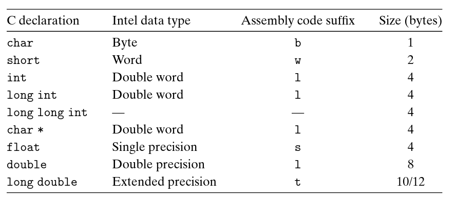

Due to its origin as a 16-bit architecture that expanded to a 32-bit one, Intel uses the term "word" to refer to a 16-bit data type. Based on this, they refer to 32-bit quantities as "double words", and 64-bit quantities as "quad words".  

  

________

### Notes
- 32-bit systems do not provide hardware support for 64-bit arithmetic (refer to ). Compiling code with data that is `64 bits` in size requires generating sequences of operations to perform the arithmetic in 32-bit chunks.

> A single piece of data can span multiple consecutive bytes in memory. For example, a double occupies 8 bytes. On a 32-bit architecture, the CPU may not be able to load or operate on all 8 bytes in a single instruction, because general-purpose registers are only 32 bits (4 bytes) wide. In such cases, the CPU may process the data in parts, or use special instructions or registers designed to handle larger data types.

- 64-bit systems still use the `b`, `w`, `l` and `q` suffixes in assembly instructions like `movb`, `movw` etc.
- These suffixes are only in AT&T syntax, whereas Intel uses no suffixes and assumes the operand size is inferred.  

________

